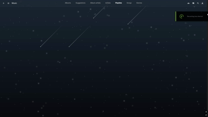

# Starry Night Theme

- A sleek, animated night sky theme for Jellyfin, with a gradient background and twinkling stars inspired by [StarryNight](https://github.com/spicetify/spicetify-themes/blob/master/StarryNight/README.md) with rounded corners and elegant design by [ElegantFin](https://github.com/lscambo13/ElegantFin/tree/main) using [Custom Javascript Plugin](https://github.com/johnpc/jellyfin-plugin-custom-javascript) for the effects.
  

# Instalation

### Part 1 JS

- Install the Custom JavaScript [plugin](https://github.com/johnpc/jellyfin-plugin-custom-javascript)

- After installing the plugin, open your Jellyfin dashboard.

- Go to Plugins, find Custom JavaScript, and click on it.

- Paste [JavaScript code](CustomJS.js) into the input field.

- Save then restart your Jellyfin server to apply the changes.

### Part 2 CSS

- In your Jellyfin dashboard, go to General.

- Find the "Custom CSS code" section.

- Paste [CSS code](custom.css) into the box.

- Scroll down and click Save.

# Credits

### Inspired by

- Spicetify theme [StarryNight](https://github.com/spicetify/spicetify-themes/blob/master/StarryNight/README.md)

### BASE THEME

- ElegantFin created by [lscambo13](https://github.com/lscambo13/ElegantFin/tree/main)

### STARS BACKGROUND

- Shooting stars created by [Delroy Prithvi](https://codepen.io/delroyprithvi/pen/LYyJROR) with copyright/permission notice:

> Pure CSS Shooting Star Animation Effect Copyright (c) 2021 by Delroy Prithvi (https://codepen.io/delroyprithvi/pen/LYyJROR)

> Permission is hereby granted, free of charge, to any person obtaining a copy of this software and associated documentation files (the "Software"), to deal in the Software without restriction, including without limitation the rights to use, copy, modify, merge, publish, distribute, sublicense, and/or sell copies of the Software, and to permit persons to whom the Software is furnished to do so, subject to the following conditions:

> The above copyright notice and this permission notice shall be included in all copies or substantial portions of the Software.

> THE SOFTWARE IS PROVIDED "AS IS", WITHOUT WARRANTY OF ANY KIND, EXPRESS OR IMPLIED, INCLUDING BUT NOT LIMITED TO THE WARRANTIES OF MERCHANTABILITY, FITNESS FOR A PARTICULAR PURPOSE AND NONINFRINGEMENT. IN NO EVENT SHALL THE AUTHORS OR COPYRIGHT HOLDERS BE LIABLE FOR ANY CLAIM, DAMAGES OR OTHER LIABILITY, WHETHER IN AN ACTION OF CONTRACT, TORT OR OTHERWISE, ARISING FROM, OUT OF OR IN CONNECTION WITH THE SOFTWARE OR THE USE OR OTHER DEALINGS IN THE SOFTWARE.

### CUSTOM JAVA SCRIPT PLUGIN

- Plugin by [johnpc](https://github.com/johnpc/jellyfin-plugin-custom-javascript) licensed under the MIT License.
